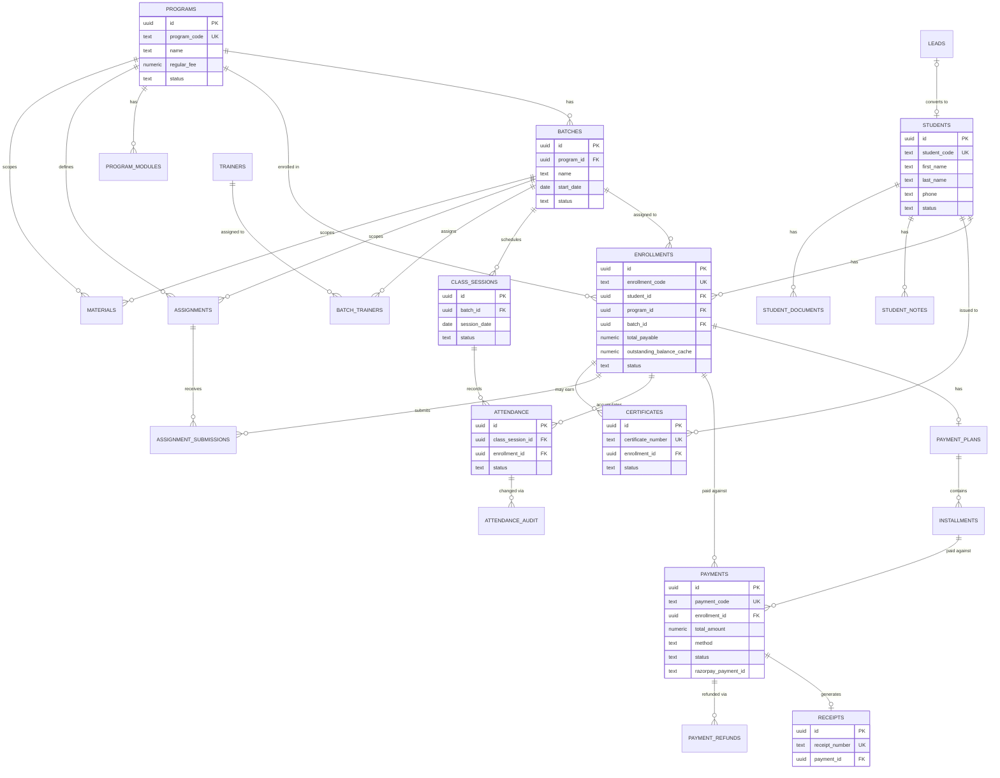

# DATABASE_SCHEMA.md

## Roicians India — Training Management System / LMS

**Status:** Draft v1.0 (Planning Phase) — implemented via versioned migrations under
`supabase/migrations/`. This document is the narrative reference; migrations are the
executable source of truth once Phase 2 begins.

---

## 1. Conventions

- **Primary keys:** `uuid default gen_random_uuid()` on every table, used for all
  foreign-key relationships.
- **Human-readable identifiers:** separate columns, generated from dedicated
  Postgres sequences (never derived from `uuid` or row order). See §3 ID Strategy.
- **Timestamps:** `created_at timestamptz not null default now()`,
  `updated_at timestamptz not null default now()` (maintained by a trigger) on every
  table. All timestamps stored UTC; display converted to `Asia/Kolkata` (configurable)
  in the UI layer only.
- **Soft delete / lifecycle:** tables holding financial or academic history use a
  `status` enum (e.g. `active`/`inactive`/`archived`) rather than deletion. A small
  number of purely operational tables (e.g. `notifications`) allow hard delete.
- **Money:** `numeric(12,2)` for all currency amounts. Percentages (tax, discount %)
  as `numeric(5,2)`. No `float`/`double precision` anywhere in a financial column.
- **Enums:** implemented as Postgres `enum` types (or `text` + `check` constraint
  where values are expected to evolve without a migration cost trade-off is
  intentionally chosen — noted per table).
- **Naming:** snake_case tables/columns, singular concept / plural table name
  (`students`, `payments`), join tables named `a_b` (`batch_trainers`).

## 2. Entity List and Purpose

| Table | Purpose |
|---|---|
| `user_roles` | Maps a Supabase Auth user to exactly one application role |
| `students` | One permanent row per person who is or was a student |
| `trainers` | Trainer profile, linked 1:1 to an auth user |
| `admins` | Admin/Super Admin profile, linked 1:1 to an auth user |
| `programs` | Course/program catalog entries |
| `program_modules` | Optional structure: Program → Modules |
| `batches` | Scheduled run of a program |
| `batch_trainers` | Many-to-many: trainers assigned to a batch |
| `enrollments` | Student ↔ Program ↔ Batch relationship + financial terms |
| `payment_plans` | Optional installment plan header per enrollment |
| `installments` | Individual installment lines under a payment plan |
| `payments` | Immutable payment transaction records |
| `payment_refunds` | Refund transactions linked to an original payment |
| `receipts` | Generated receipt documents (one per successful payment) |
| `class_sessions` | Individual scheduled class occurrence within a batch |
| `attendance` | Attendance record per student per class session |
| `attendance_audit` | Change history for attendance edits after initial marking |
| `materials` | Uploaded/linked learning material, scoped to program/batch/session/module |
| `assignments` | Assignment definition |
| `assignment_submissions` | Student submission against an assignment |
| `certificates` | Issued certificate records |
| `leads` | Public inquiry/lead pipeline |
| `notifications` | In-app (and future multi-channel) notification feed |
| `email_log` | Record of transactional emails sent |
| `company_settings` | Single-row centralized branding/tax/numbering configuration |
| `audit_logs` | Generic audit trail for sensitive actions across entities |
| `student_notes` | Internal staff-only notes on a student |
| `student_documents` | Uploaded student documents (ID proof, etc.) |

Tables intentionally **not** created in V1 (would be premature): `invoices` (reserved
for later — see `ARCHITECTURE.md` §11 and `DECISIONS_NEEDED.md`), tenant/branch
tables (see multi-branch readiness note), placement/career tables.

## 3. Human-Readable ID Strategy

Three independent, sequence-backed numbering schemes, unified under one pattern so
the same concurrency-safety guarantee applies everywhere:

```sql
create sequence student_id_seq start 10001 increment 1;
create sequence enrollment_id_seq start 1 increment 1;
create sequence payment_id_seq start 1 increment 1;
create sequence receipt_number_seq start 1 increment 1;   -- reset logic below
create sequence certificate_number_seq start 1 increment 1; -- reset logic below
```

- **Student ID** (`students.student_code`): `nextval('student_id_seq')` cast to
  text, e.g. `10001`. Assigned exactly once, at row insert, inside the same
  transaction as the insert — never editable afterward (enforced by omitting it from
  any update statement/UI and, defense-in-depth, a trigger that raises on attempted
  change).
- **Enrollment ID** (`enrollments.enrollment_code`): formatted
  `ENR-{nextval('enrollment_id_seq')::text padded to 6}`, e.g. `ENR-000123`.
  Immutable after creation.
- **Payment ID** (`payments.payment_code`): formatted
  `PAY-{nextval('payment_id_seq')::text padded to 6}`, e.g. `PAY-000456`. Distinct
  from Razorpay's own `order_id`/`payment_id`, which are stored in separate columns.
- **Receipt number** (`receipts.receipt_number`): formatted
  `REC-{year}-{nextval('receipt_number_seq')::text padded to 6}`, e.g.
  `REC-2026-000001`. The sequence resets per calendar year via a scheduled admin
  action or a year-partitioned sequence name resolved at generation time (see
  implementation note below); format itself is configurable in `company_settings`
  (prefix, padding width, year inclusion) without changing the underlying
  concurrency mechanism.
- **Certificate ID** (`certificates.certificate_number`): same pattern,
  `CERT-{year}-{nextval('certificate_number_seq')::text padded to 6}`.

**Concurrency safety:** Postgres sequences (`nextval`) are inherently atomic and
safe under concurrent transactions — this is what satisfies §92/§93 without any
application-level locking. All numbering happens inside the same DB transaction that
inserts the owning row, so a rolled-back insert does not leave a "used" number
permanently missing a row (a sequence gap on rollback is acceptable and standard;
gaps are not a correctness issue, only true duplicates would be).

**Program Code** (`programs.program_code`) is **not** sequence-generated — it is
admin-entered free text, enforced unique via a `unique` constraint, with an optional
regex check configured in `company_settings` (see REQUIREMENTS.md item 1 in §7).

## 4. Core Tables (Key Columns)

### `user_roles`
- `id uuid pk`
- `auth_user_id uuid unique not null` — references `auth.users(id)`
- `role text not null check (role in ('super_admin','admin','trainer','student'))`
- `created_at`, `updated_at`
- One row per auth user; a user has exactly one role in V1 (simplifies RBAC; a
  future multi-role-per-user need would add a join table without breaking this).

### `students`
- `id uuid pk`
- `student_code text unique not null` — human Student ID, e.g. `10001`
- `auth_user_id uuid unique references auth.users(id)` — nullable until portal
  account is provisioned
- `first_name text not null`, `last_name text not null`, `preferred_name text`
- `email text` — contact email, **not** unique (see REQUIREMENTS.md §7 item 4)
- `phone text not null` — normalized `+<countrycode><number>`, stored as text
- `alternate_phone text`
- `date_of_birth date`, `gender text`
- `address_line1 text`, `address_line2 text`, `city text`, `state text`,
  `postal_code text`, `country text default 'IN'`
- `emergency_contact_name text`, `emergency_contact_phone text`
- `registration_date date not null default current_date`
- `status text not null default 'active' check (status in ('active','inactive','archived'))`
- `profile_photo_path text` — Storage object key, not a public URL
- `lead_id uuid references leads(id)` — preserves originating lead if converted
- `created_at`, `updated_at`
- Indexes: `unique(student_code)`, `index(phone)`, `index(email)`,
  `index(lower(first_name || ' ' || last_name))` for name search.

### `trainers`
- `id uuid pk`
- `auth_user_id uuid unique not null references auth.users(id)`
- `first_name text not null`, `last_name text not null`
- `email text unique not null`, `phone text`
- `bio text`, `specialization text[]`
- `status text not null default 'active' check (status in ('active','inactive'))`
- `created_at`, `updated_at`

### `admins`
- `id uuid pk`
- `auth_user_id uuid unique not null references auth.users(id)`
- `first_name text not null`, `last_name text not null`, `email text unique not null`
- `role_level text not null check (role_level in ('admin','super_admin'))` — mirrors
  `user_roles.role` for convenience joins; `user_roles` remains authoritative.
- `status text not null default 'active'`
- `created_at`, `updated_at`

### `programs`
- `id uuid pk`
- `program_code text unique not null`
- `name text not null`
- `description text`
- `category text`
- `duration_value integer`, `duration_unit text check (duration_unit in ('hours','days','weeks','months'))`
- `delivery_mode text check (delivery_mode in ('online','in_person','hybrid'))`
- `regular_fee numeric(12,2) not null`
- `registration_fee numeric(12,2) not null default 0`
- `tax_rate_percent numeric(5,2)` — nullable = "use company default"
- `status text not null default 'draft' check (status in ('draft','active','inactive','archived'))`
- `thumbnail_path text`
- `certificate_eligible boolean not null default true`
- `installments_allowed boolean not null default true`
- `created_at`, `updated_at`

### `program_modules`
- `id uuid pk`
- `program_id uuid not null references programs(id) on delete cascade`
- `title text not null`, `description text`, `sequence integer not null`
- `created_at`, `updated_at`
- `unique(program_id, sequence)`

### `batches`
- `id uuid pk`
- `program_id uuid not null references programs(id) on delete restrict`
- `name text not null` — e.g. "September 2026 Weekend Batch"
- `start_date date not null`, `expected_end_date date`
- `days_of_week text[]` — e.g. `{sat,sun}`
- `start_time time`, `end_time time`, `timezone text not null default 'Asia/Kolkata'`
- `delivery_mode text check (delivery_mode in ('online','in_person','hybrid'))`
- `capacity integer`
- `status text not null default 'draft' check (status in ('draft','upcoming','active','completed','cancelled','archived'))`
- `meeting_link text`, `location text`
- `notes text`
- `created_at`, `updated_at`
- Index: `(program_id, status)`

### `batch_trainers`
- `id uuid pk`
- `batch_id uuid not null references batches(id) on delete cascade`
- `trainer_id uuid not null references trainers(id) on delete restrict`
- `is_primary boolean not null default false`
- `unique(batch_id, trainer_id)`

### `enrollments`
- `id uuid pk`
- `enrollment_code text unique not null`
- `student_id uuid not null references students(id) on delete restrict`
- `program_id uuid not null references programs(id) on delete restrict`
- `batch_id uuid references batches(id) on delete set null` — nullable to support a
  "registered, not yet batch-assigned" state
- `enrollment_date date not null default current_date`
- `status text not null default 'lead' check (status in ('lead','applicant','registered','enrolled','active','on_hold','completed','withdrawn','cancelled'))`
- `regular_fee numeric(12,2) not null` — snapshot from program at enrollment time
- `agreed_fee numeric(12,2) not null` — after any negotiation
- `discount_amount numeric(12,2) not null default 0`
- `discount_reason text`
- `registration_fee numeric(12,2) not null default 0`
- `tax_amount numeric(12,2) not null default 0`
- `total_payable numeric(12,2) not null` — `agreed_fee - discount_amount + registration_fee + tax_amount`
- `amount_paid_cache numeric(12,2) not null default 0` — **cached/derived only**,
  recomputed transactionally on every payment/refund; never directly editable via
  any API. See §6.
- `outstanding_balance_cache numeric(12,2) not null default 0` — same rule.
- `payment_plan_type text check (payment_plan_type in ('full','installments'))`
- `source text` — enrollment source (referral, walk-in, website, etc.)
- `notes text`
- `created_at`, `updated_at`
- Indexes: `unique(enrollment_code)`, `index(student_id)`, `index(program_id)`,
  `index(batch_id)`, `index(status)`
- **Constraint:** no unique constraint forcing one-enrollment-per-student — a
  student may have multiple enrollments, including multiple enrollments in the same
  program over time (re-enrollment), by design.

### `payment_plans`
- `id uuid pk`
- `enrollment_id uuid unique not null references enrollments(id) on delete cascade`
- `total_amount numeric(12,2) not null`
- `created_at`, `updated_at`

### `installments`
- `id uuid pk`
- `payment_plan_id uuid not null references payment_plans(id) on delete cascade`
- `sequence integer not null`
- `label text` — e.g. "Registration", "Installment 1"
- `amount numeric(12,2) not null`
- `due_date date not null`
- `status text not null default 'upcoming' check (status in ('upcoming','due','partially_paid','paid','overdue','waived'))`
- `amount_paid_cache numeric(12,2) not null default 0`
- `created_at`, `updated_at`
- `unique(payment_plan_id, sequence)`

### `payments`
- `id uuid pk`
- `payment_code text unique not null`
- `student_id uuid not null references students(id) on delete restrict`
- `enrollment_id uuid not null references enrollments(id) on delete restrict`
- `installment_id uuid references installments(id) on delete set null`
- `payment_type text not null check (payment_type in ('registration','full','installment','partial','other'))`
- `amount numeric(12,2) not null`, `tax_amount numeric(12,2) not null default 0`,
  `total_amount numeric(12,2) not null`
- `method text not null check (method in ('razorpay','cash','bank_transfer','upi','cheque','other'))`
- `status text not null default 'pending' check (status in ('pending','authorized','paid','failed','refunded','partially_refunded','cancelled'))`
- `razorpay_order_id text`, `razorpay_payment_id text`, `razorpay_signature text`
- `internal_reference text` — offline payment reference (cheque no., UTR, etc.)
- `notes text`
- `created_by uuid references admins(id)` — null for student-initiated online payments
- `paid_at timestamptz`
- `created_at`, `updated_at`
- Indexes: `unique(payment_code)`,
  `unique(razorpay_payment_id) where razorpay_payment_id is not null` (webhook
  idempotency), `index(enrollment_id)`, `index(student_id)`, `index(status)`
- **Immutability rule:** application code never `UPDATE`s `amount`/`total_amount`
  once a payment reaches `paid`; corrections happen via a `payment_refunds` row or a
  new offsetting payment, never by editing history.

### `payment_refunds`
- `id uuid pk`
- `payment_id uuid not null references payments(id) on delete restrict`
- `amount numeric(12,2) not null`
- `reason text`
- `razorpay_refund_id text`
- `status text not null default 'initiated' check (status in ('initiated','processed','failed'))`
- `initiated_by uuid references admins(id)`
- `created_at`, `updated_at`

### `receipts`
- `id uuid pk`
- `receipt_number text unique not null`
- `payment_id uuid unique not null references payments(id) on delete restrict`
- `pdf_path text not null` — Storage object key
- `emailed_at timestamptz`
- `created_at`

### `class_sessions`
- `id uuid pk`
- `batch_id uuid not null references batches(id) on delete cascade`
- `trainer_id uuid references trainers(id) on delete set null`
- `session_date date not null`, `start_time time`, `end_time time`
- `topic text`, `description text`, `meeting_link text`
- `status text not null default 'scheduled' check (status in ('scheduled','completed','cancelled','rescheduled'))`
- `notes text`
- `created_at`, `updated_at`
- Index: `(batch_id, session_date)`

### `attendance`
- `id uuid pk`
- `class_session_id uuid not null references class_sessions(id) on delete cascade`
- `enrollment_id uuid not null references enrollments(id) on delete cascade`
- `student_id uuid not null references students(id) on delete cascade`
- `batch_id uuid not null references batches(id) on delete cascade` — denormalized
  for query performance (avoids joining through class_sessions for every report)
- `status text not null check (status in ('present','absent','late','excused'))`
- `marked_by uuid not null` — references either `trainers.id` or `admins.id`;
  modeled as `marked_by_type text check (in ('trainer','admin'))` +
  `marked_by uuid` pair rather than a polymorphic FK
- `marked_at timestamptz not null default now()`
- `notes text`
- `created_at`, `updated_at`
- `unique(class_session_id, student_id)` — one attendance row per student per
  session
- Index: `(enrollment_id)`, `(batch_id, status)`

### `attendance_audit`
- `id uuid pk`
- `attendance_id uuid not null references attendance(id) on delete cascade`
- `changed_by uuid not null`, `changed_by_type text check (in ('trainer','admin'))`
- `previous_status text`, `new_status text`
- `changed_at timestamptz not null default now()`

### `materials`
- `id uuid pk`
- `program_id uuid references programs(id) on delete cascade`
- `batch_id uuid references batches(id) on delete cascade`
- `module_id uuid references program_modules(id) on delete cascade`
- `class_session_id uuid references class_sessions(id) on delete cascade`
- `title text not null`, `description text`
- `material_type text not null check (material_type in ('file','link','video'))`
- `file_path text` — Storage key, null if `material_type = 'link'`
- `external_url text` — for links/video
- `uploaded_by uuid not null`, `uploaded_by_type text check (in ('admin','trainer'))`
- `created_at`, `updated_at`
- **Constraint:** at least one of `program_id`/`batch_id`/`module_id`/
  `class_session_id` must be non-null (check constraint) so every material is
  scoped to something.

### `assignments`
- `id uuid pk`
- `program_id uuid not null references programs(id) on delete cascade`
- `batch_id uuid not null references batches(id) on delete cascade`
- `module_id uuid references program_modules(id) on delete set null`
- `trainer_id uuid not null references trainers(id) on delete restrict`
- `title text not null`, `description text`
- `attachment_path text`
- `assigned_date date not null default current_date`, `due_date date not null`
- `max_marks numeric(6,2)`
- `status text not null default 'active' check (status in ('active','closed'))`
- `created_at`, `updated_at`

### `assignment_submissions`
- `id uuid pk`
- `assignment_id uuid not null references assignments(id) on delete cascade`
- `enrollment_id uuid not null references enrollments(id) on delete cascade`
- `student_id uuid not null references students(id) on delete cascade`
- `submitted_at timestamptz`
- `text_response text`, `file_path text`
- `status text not null default 'not_submitted' check (status in ('not_submitted','submitted','late','reviewed','resubmission_requested'))`
- `marks numeric(6,2)`, `trainer_feedback text`
- `reviewed_by uuid references trainers(id)`, `reviewed_at timestamptz`
- `created_at`, `updated_at`
- `unique(assignment_id, enrollment_id)`

### `certificates`
- `id uuid pk`
- `certificate_number text unique not null`
- `enrollment_id uuid not null references enrollments(id) on delete restrict`
- `student_id uuid not null references students(id) on delete restrict`
- `program_id uuid not null references programs(id) on delete restrict`
- `completion_date date not null`, `issue_date date not null default current_date`
- `status text not null default 'issued' check (status in ('issued','revoked'))`
- `pdf_path text not null`
- `revoked_reason text`, `revoked_at timestamptz`
- `created_at`, `updated_at`
- Public verification exposes only: certificate_number, student display name,
  program name, issue_date, status — never the full row.

### `leads`
- `id uuid pk`
- `name text not null`, `email text`, `phone text`
- `program_id uuid references programs(id)`
- `message text`
- `source text` — website form, referral, campaign, etc.
- `status text not null default 'new' check (status in ('new','contacted','follow_up','qualified','converted','not_interested','closed'))`
- `converted_student_id uuid references students(id)`
- `created_at`, `updated_at`

### `notifications`
- `id uuid pk`
- `recipient_auth_user_id uuid not null references auth.users(id) on delete cascade`
- `type text not null`, `title text not null`, `body text`
- `data jsonb`
- `channel text not null default 'in_app' check (channel in ('in_app','email','whatsapp'))`
- `status text not null default 'unread' check (status in ('unread','read'))`
- `read_at timestamptz`
- `created_at`

### `email_log`
- `id uuid pk`
- `recipient_email text not null`, `template_key text not null`
- `status text not null check (status in ('sent','failed'))`
- `provider_message_id text`, `error_message text`
- `related_entity_type text`, `related_entity_id uuid`
- `created_at`

### `company_settings`
- `id uuid pk` — single row enforced by application logic (and a check constraint
  on a fixed `id` value, or a `singleton boolean unique default true` trick)
- `company_name text not null`, `legal_name text`, `logo_path text`
- `address text`, `phone text`, `email text`, `website text`
- `gstin text`, `tax_enabled boolean not null default false`,
  `default_tax_rate_percent numeric(5,2) not null default 0`, `tax_label text default 'GST'`
- `student_id_prefix text default ''`, `receipt_number_format text default 'REC-{year}-{seq:6}'`
- `certificate_number_format text default 'CERT-{year}-{seq:6}'`
- `certificate_signatory_name text`, `certificate_signatory_title text`
- `social_links jsonb`
- `updated_at`

### `audit_logs`
- `id uuid pk`
- `actor_auth_user_id uuid references auth.users(id)`
- `actor_role text`
- `action text not null` — e.g. `enrollment.status_changed`, `payment.recorded_offline`
- `entity_type text not null`, `entity_id uuid not null`
- `before_data jsonb`, `after_data jsonb`
- `created_at timestamptz not null default now()`
- Index: `(entity_type, entity_id)`, `(created_at)`
- Never stores passwords, tokens, or secrets (enforced by code review + a redaction
  helper used by every audit-write call site).

### `student_notes`
- `id uuid pk`
- `student_id uuid not null references students(id) on delete cascade`
- `note text not null`
- `created_by uuid not null references admins(id)`
- `created_at`
- Staff-only; never surfaced to the student portal.

### `student_documents`
- `id uuid pk`
- `student_id uuid not null references students(id) on delete cascade`
- `document_type text not null`, `file_path text not null`
- `uploaded_by uuid not null`, `uploaded_by_type text check (in ('admin','student'))`
- `created_at`

## 5. Relationships Summary

- One `student` → many `enrollments` (1:N)
- One `program` → many `batches` (1:N)
- One `program` → many `enrollments` (1:N)
- One `batch` → many `enrollments` (1:N), many `class_sessions` (1:N)
- `batch` ↔ `trainer` many-to-many via `batch_trainers`
- One `enrollment` → zero-or-one `payment_plan` → many `installments` (1:N)
- One `enrollment` → many `payments` (1:N); one `payment` → zero-or-one `installment`
- One `payment` → zero-or-one `receipt` (1:1), zero-or-many `payment_refunds`
- One `class_session` → many `attendance` rows (one per enrolled student)
- One `enrollment` → many `attendance` rows (across all its sessions)
- One `assignment` → many `assignment_submissions`; one `enrollment` → one
  submission per assignment
- One `enrollment` → zero-or-many `certificates` (normally zero-or-one per
  completed enrollment, not DB-enforced as exactly one, since reissue creates a new
  row while the old one is marked revoked)

## 6. Balance Calculation (Authoritative Definition)

For a given `enrollment`:

```
total_payable          = agreed_fee - discount_amount + registration_fee + tax_amount
valid_payments_sum     = sum(payments.total_amount)
                          where enrollment_id = :id and status = 'paid'
approved_refunds_sum   = sum(payment_refunds.amount)
                          where payment.enrollment_id = :id and payment_refunds.status = 'processed'
amount_paid            = valid_payments_sum - approved_refunds_sum
outstanding_balance    = total_payable - amount_paid
```

`enrollments.amount_paid_cache` and `enrollments.outstanding_balance_cache` store
this computation's result for fast dashboard/list reads, but are **recomputed by a
server-side transactional function** every time a payment or refund's status
changes to/from a terminal state — never set directly by any client request or
Admin form field. Any discrepancy investigation always re-derives from `payments`
and `payment_refunds`, which are the source of truth (§90/§91 compliance).

## 7. Money Handling

- Postgres: `numeric(12,2)` for all amounts — exact decimal arithmetic, no binary
  floating-point rounding error.
- TypeScript domain layer: money values are handled as integer paise internally
  during arithmetic (`Math.round(rupees * 100)`) using a small `Money` helper type,
  or via a decimal library (`decimal.js`), converting to/from `numeric` strings at
  the DB boundary — never native `number` addition/subtraction chains on rupee
  floats for anything that posts to the ledger.
- All amount fields serialized over the API as strings (not JS numbers) to avoid
  precision loss in transit.

## 8. Indexing & Performance Notes

- Every foreign key has a supporting index (Postgres does not auto-index FKs).
- Composite indexes for common admin queries: `payments(status, created_at desc)`,
  `enrollments(status, program_id)`, `attendance(batch_id, status)`.
- A Postgres view `enrollment_summary` joins enrollment + cached balances +
  student + program + batch for the Admin list screen, avoiding N+1 fetches.
- A Postgres view `student_attendance_summary` pre-aggregates attendance counts
  per enrollment for the percentage calculation.

## 9. Entity-Relationship Diagram



## 10. Migration Strategy

- Managed exclusively via `supabase/migrations/*.sql`, applied with
  `supabase db push` (or the Supabase CLI's migration commands) in CI/CD before a
  new deployment goes live — never hand-edited on the production database.
- Each phase in `IMPLEMENTATION_PLAN.md` that touches the schema ships its own
  migration file(s), keeping migration history reproducible and reviewable per
  feature.
- Seed data (`supabase/seed.sql`) is clearly separated and only ever applied to
  local/dev/staging, never production.
